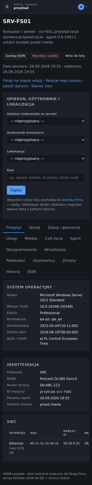
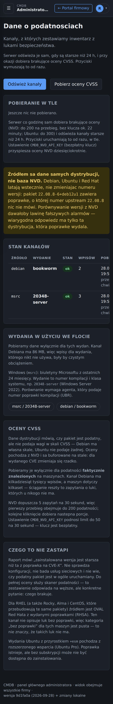
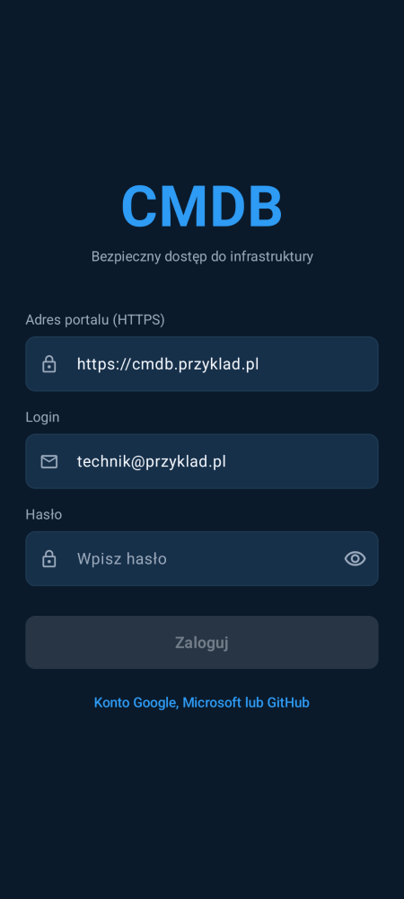
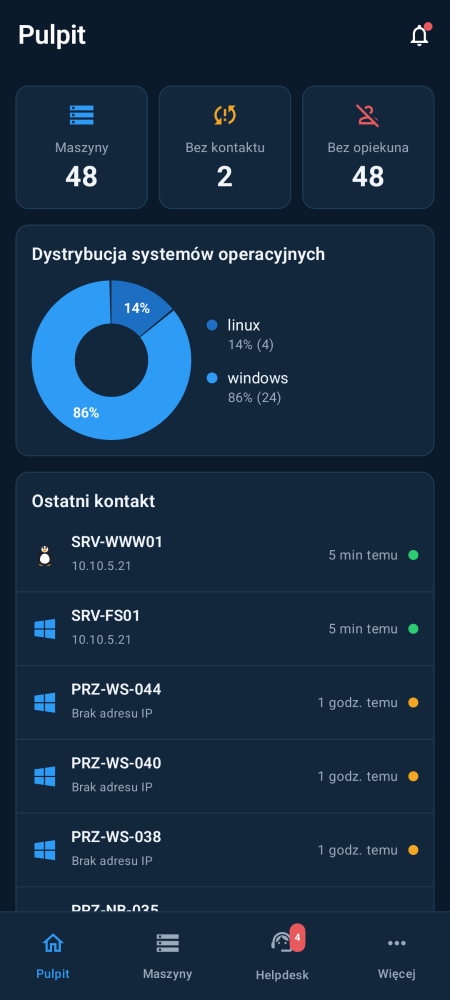
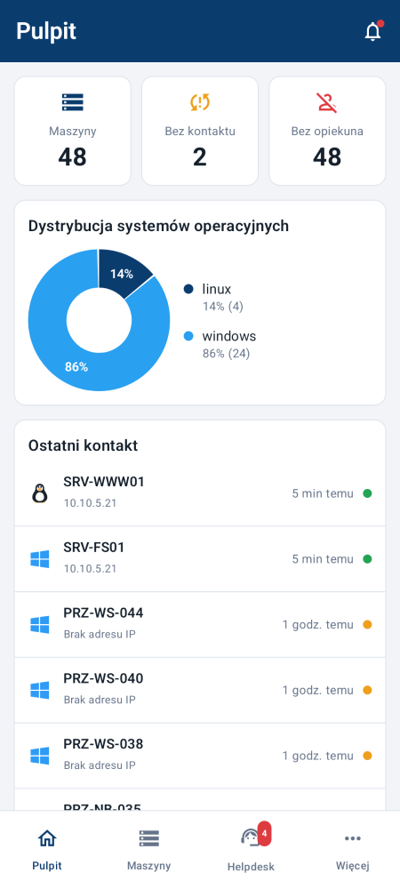
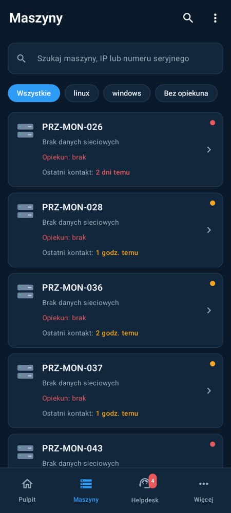
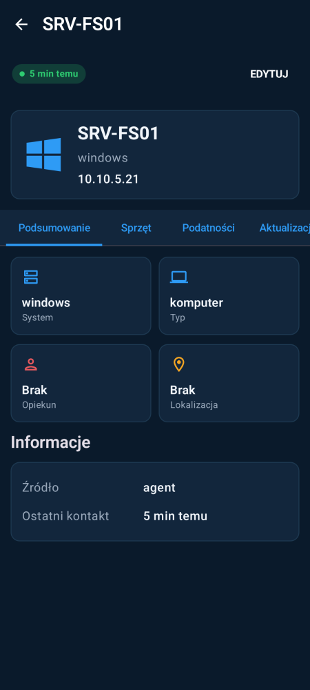
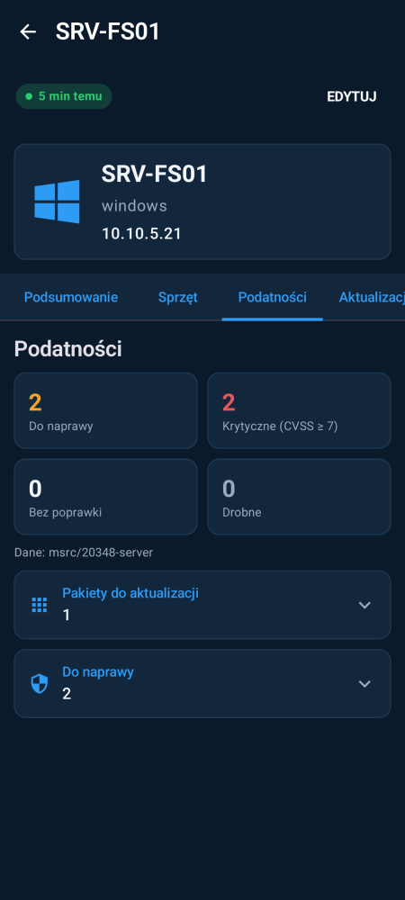
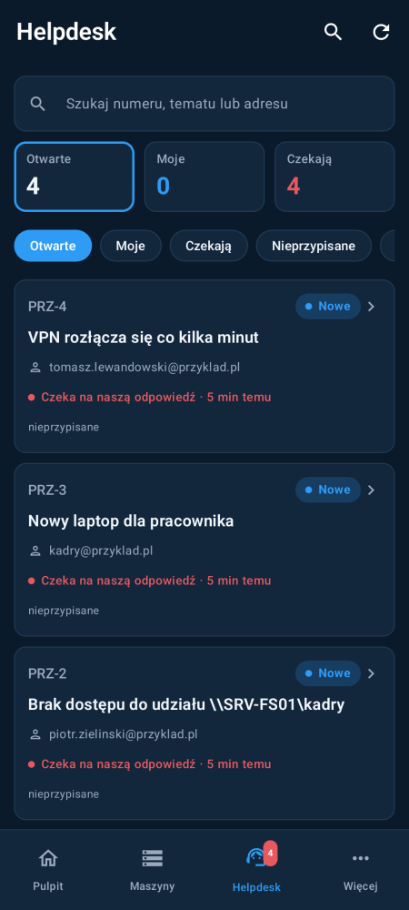
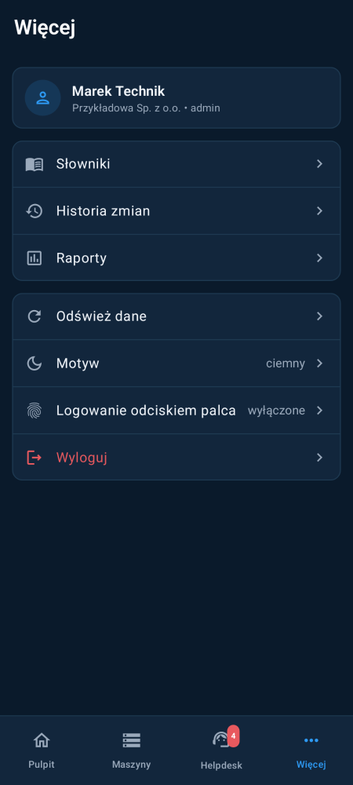

# Jak wygląda panel — przykładowe zrzuty

Zrzuty **portalu WWW** zrobione na przykładowych danych (firma „Przykładowa
Sp. z o.o.”, maszyny wygenerowane w teście), w motywie ciemnym i jasnym, w dwóch
szerokościach: ekran komputera (1440 px) i przeglądarka w telefonie (390 px).

To nie jest aplikacja na Androida — ta ma własne, natywne ekrany i jest opisana
niżej, w sekcji [Aplikacja Android](#aplikacja-android).

Odświeżenie po zmianie wyglądu — z katalogu `server`, z bazą testową jak dla
pozostałych testów:

```
pip install playwright && playwright install chromium
ZRZUTY=1 python -m pytest tests/zrzuty_ekranu.py -q
```

Skrypt: [`server/tests/zrzuty_ekranu.py`](../../server/tests/zrzuty_ekranu.py).
Zwykły przebieg testów go pomija.

## Portal firmowy

| Ekran | Komputer | Przeglądarka w telefonie |
|---|---|---|
| **Pulpit** — zasoby, agenci, typy sprzętu, systemy, najbardziej podatne maszyny, wersje agentów | [](komputer/01-pulpit.jpg) | [](przegladarka-telefon/01-pulpit.jpg) |
| **Pulpit w jasnym motywie** | [](komputer/05-pulpit-jasny.jpg) | [](przegladarka-telefon/05-pulpit-jasny.jpg) |
| **Lista zasobów** z filtrami | [](komputer/02-zasoby.jpg) | [](przegladarka-telefon/02-zasoby.jpg) |
| **Karta maszyny** — system, identyfikacja, sieć | [](komputer/03-karta-maszyny.jpg) | [](przegladarka-telefon/03-karta-maszyny.jpg) |
| **Podatności maszyny** (Windows, dane Microsoftu) | [](komputer/04-podatnosci-maszyny.jpg) | [](przegladarka-telefon/04-podatnosci-maszyny.jpg) |

## Administracja (administrator główny)

| Ekran | Komputer | Przeglądarka w telefonie |
|---|---|---|
| **Przegląd instalacji** — firmy, agenci, podatności we wszystkich firmach, stan systemu | [](komputer/10-przeglad-administratora.jpg) | [](przegladarka-telefon/10-przeglad-administratora.jpg) |
| **Stan portalu** — ruch, czasy odpowiedzi, serwer, baza, blokady logowania | [](komputer/11-stan-portalu.jpg) | [](przegladarka-telefon/11-stan-portalu.jpg) |
| **Dane o podatnościach** — kanały dystrybucji i Microsoftu | [](komputer/12-dane-o-podatnosciach.jpg) | [](przegladarka-telefon/12-dane-o-podatnosciach.jpg) |

## Aplikacja Android

Natywna aplikacja (Kotlin, Jetpack Compose) ma własne ekrany, inne niż portal
w przeglądarce. Zrzuty rysuje w CI narzędzie Paparazzi — bez telefonu
i emulatora — z prawdziwych odpowiedzi API mobilnego zapisanych na tych samych
przykładowych danych (`android/app/src/test/resources/zrzuty/`). Odświeżają się
same po każdej zmianie w `android/` (workflow `android-zrzuty.yml`).

| Logowanie | Pulpit | Pulpit (jasny) | Maszyny |
|---|---|---|---|
|  |  |  |  |

| Karta maszyny | Podatności maszyny | Helpdesk | Więcej |
|---|---|---|---|
|  |  |  |  |

Test: [`ZrzutyEkranow.kt`](../../android/app/src/test/java/pl/hubzso/cmdb/ui/ZrzutyEkranow.kt).
Nowe dane dla aplikacji: `ZRZUTY=1 python -m pytest tests/zrzuty_ekranu.py -k dane` (z katalogu `server`).
