# Jak wygląda panel — przykładowe zrzuty

Zrzuty zrobione na **przykładowych danych** (firma „Przykładowa Sp. z o.o.”,
maszyny wygenerowane w teście), w motywie ciemnym i jasnym, w dwóch
szerokościach: ekran komputera (1440 px) i telefon (390 px).

Odświeżenie po zmianie wyglądu — z katalogu `server`, z bazą testową jak dla
pozostałych testów:

```
pip install playwright && playwright install chromium
ZRZUTY=1 python -m pytest tests/zrzuty_ekranu.py -q
```

Skrypt: [`server/tests/zrzuty_ekranu.py`](../../server/tests/zrzuty_ekranu.py).
Zwykły przebieg testów go pomija.

## Portal firmowy

| Ekran | Komputer | Telefon |
|---|---|---|
| **Pulpit** — zasoby, agenci, typy sprzętu, systemy, najbardziej podatne maszyny, wersje agentów | [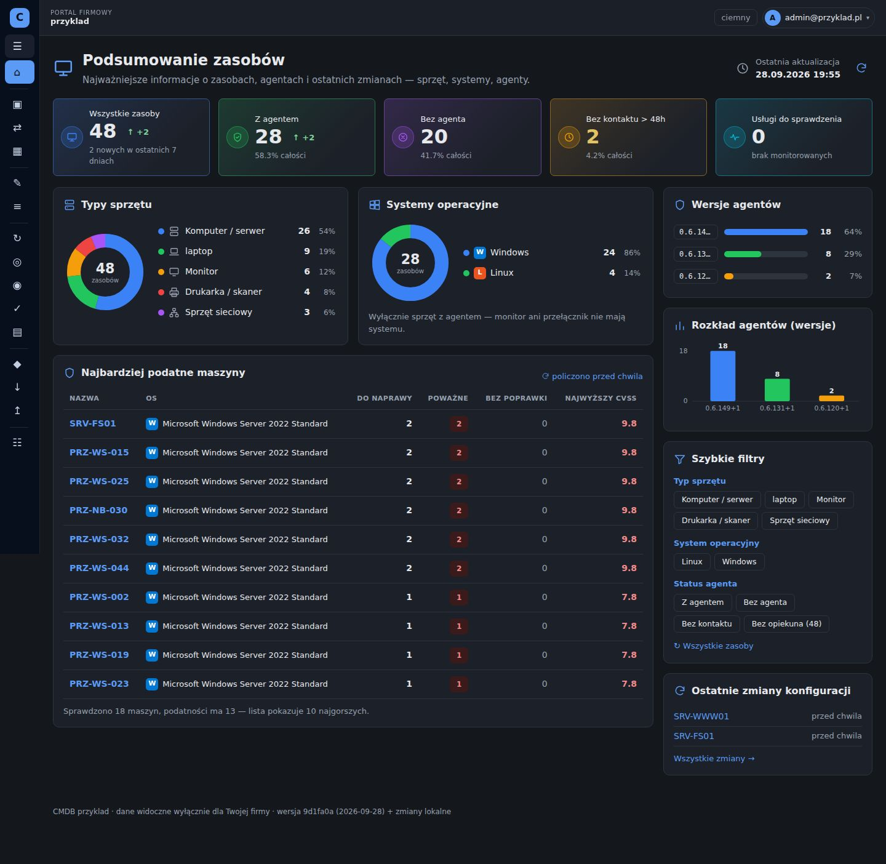](komputer/01-pulpit.jpg) | [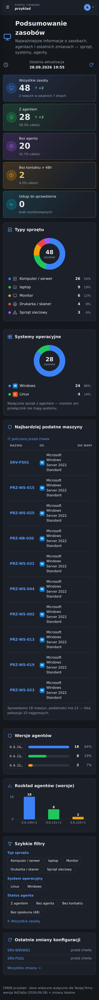](telefon/01-pulpit.jpg) |
| **Pulpit w jasnym motywie** | [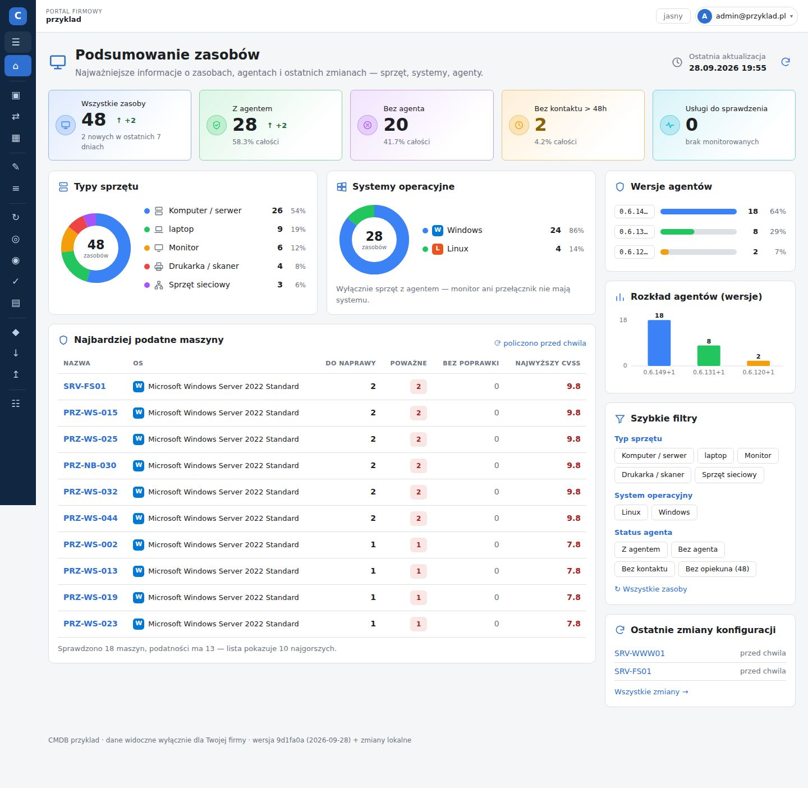](komputer/05-pulpit-jasny.jpg) | [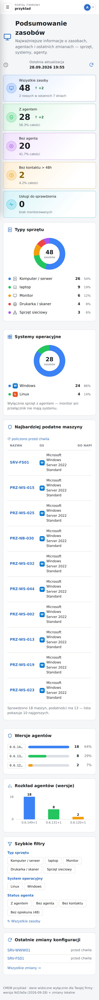](telefon/05-pulpit-jasny.jpg) |
| **Lista zasobów** z filtrami | [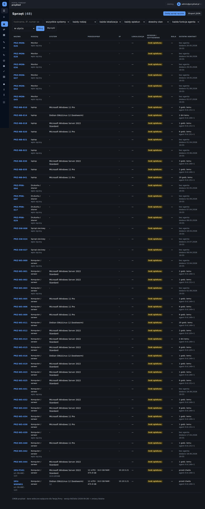](komputer/02-zasoby.jpg) | [](telefon/02-zasoby.jpg) |
| **Karta maszyny** — system, identyfikacja, sieć | [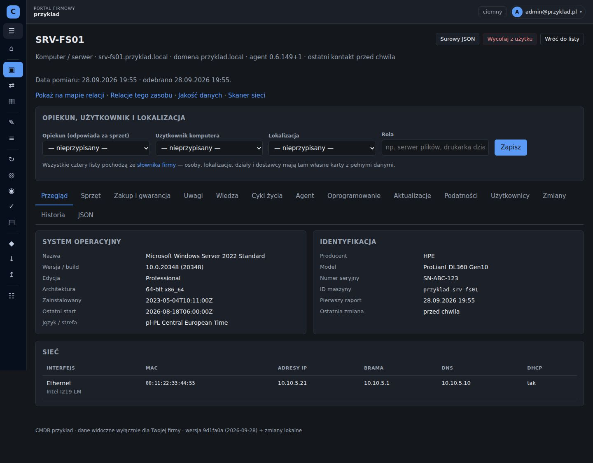](komputer/03-karta-maszyny.jpg) | [](telefon/03-karta-maszyny.jpg) |
| **Podatności maszyny** (Windows, dane Microsoftu) | [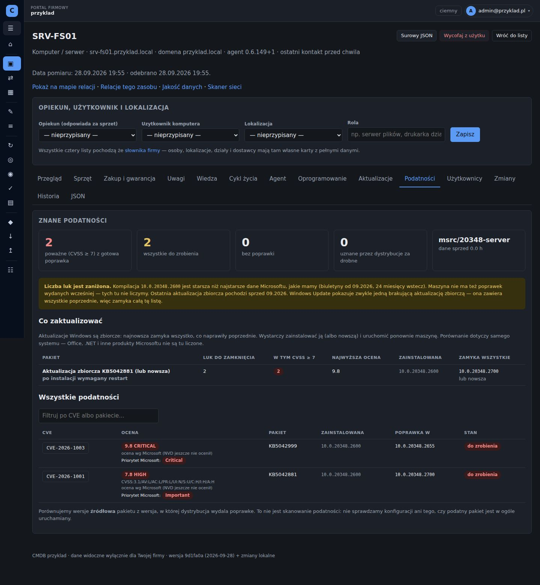](komputer/04-podatnosci-maszyny.jpg) | [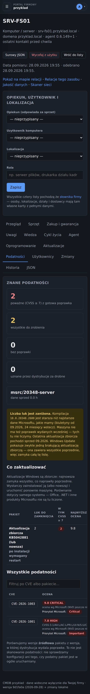](telefon/04-podatnosci-maszyny.jpg) |

## Administracja (administrator główny)

| Ekran | Komputer | Telefon |
|---|---|---|
| **Przegląd instalacji** — firmy, agenci, podatności we wszystkich firmach, stan systemu | [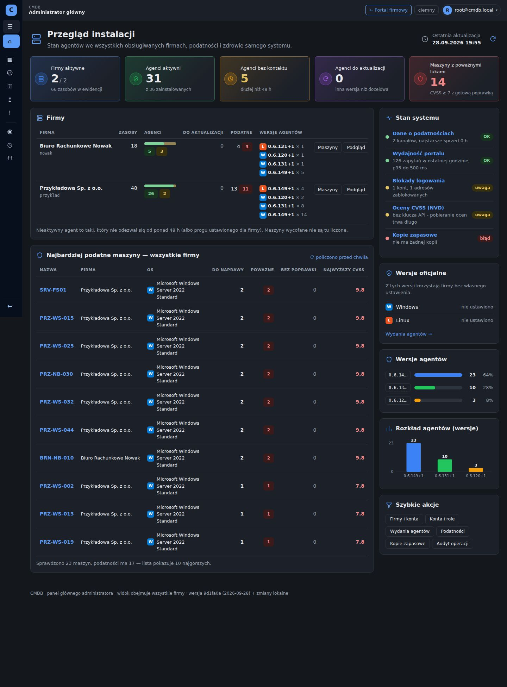](komputer/10-przeglad-administratora.jpg) | [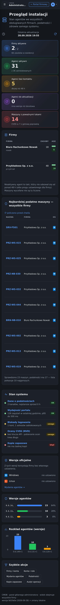](telefon/10-przeglad-administratora.jpg) |
| **Stan portalu** — ruch, czasy odpowiedzi, serwer, baza, blokady logowania | [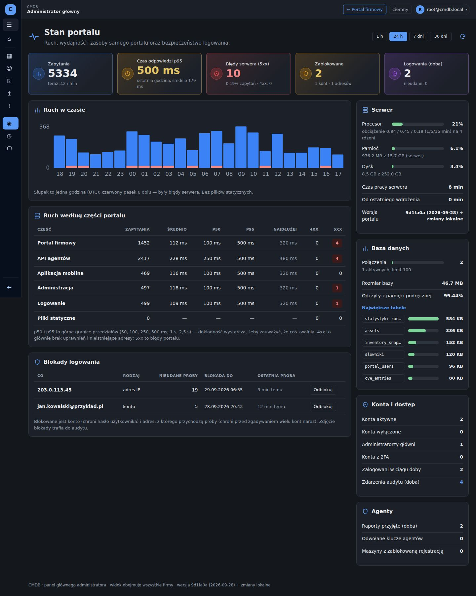](komputer/11-stan-portalu.jpg) | [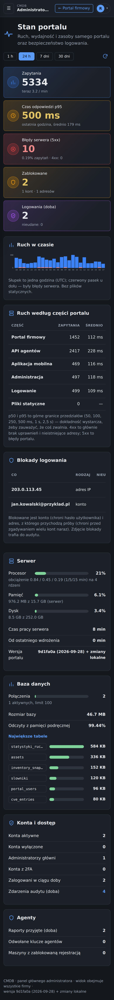](telefon/11-stan-portalu.jpg) |
| **Dane o podatnościach** — kanały dystrybucji i Microsoftu | [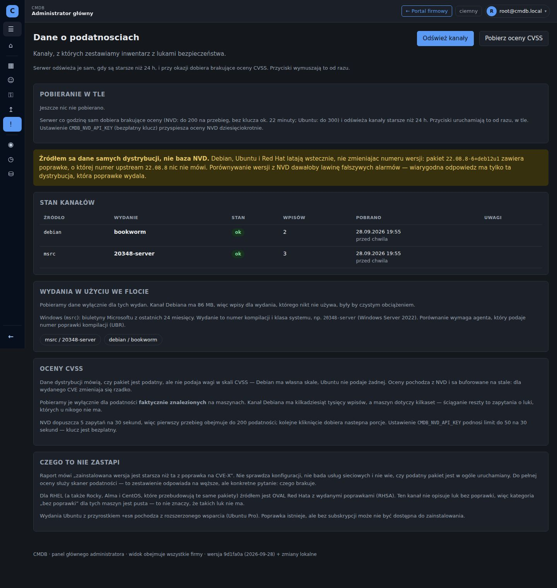](komputer/12-dane-o-podatnosciach.jpg) | [](telefon/12-dane-o-podatnosciach.jpg) |
